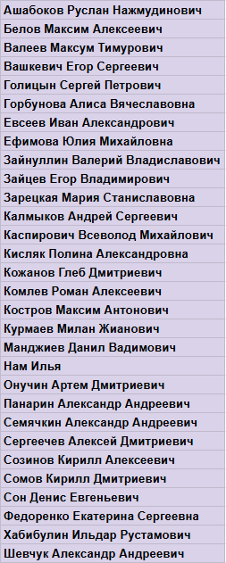

# Правила поступления на кафедру в 2024 году

## Общие слова


**Вся важная информация / объявления / обновления - в чате** [**https://t.me/kis\_new\_2024**](https://t.me/kis\_new\_2024)


Данная страница содержит информацию именно **о поступлении на кафедру**. \
\
Помимо этого, могут быть дополнительные требования от учебного офиса / ФПМИ / МФТИ, связанные с выбором кафедры (например, подача заявления), поступлением в магистратуру (да, для зачисления на нашу кафедру в магистратуру надо не только пройти отбор к нам на кафедру, но и поступить в магистратуру ФПМИ в принципе) и т.д., и т.п.


_Обязательно следите за объявлениями учебного офиса (для поступления на кафедру в бакалавриате), приемной комиссии ФПМИ / МФТИ (для поступления на кафедру в магистратуру) и др._


## Поступление в бакалавриат

### Совместная программа МФТИ - РАНХиГС

Если вы обучаетесь на этой программе, то на нашу кафедру вы поступаете без какого-либо конкурса (таковы условия программы). Вам достаточно просто написать в деканате заявление о выборе нашей кафедры.


_Обратите внимание: формально у студентов данной программы базовой кафедрой может быть только кафедра КИС, но дирекция ФПМИ может пойти навстречу и согласовать ИУП с обучением на другой кафедре. Однако это приведет к ряду проблем: рассогласованность расписаний занятий (1С, РАНХиГС и МФТИ согласуют между собой время пар с учетом логистики) и необходимость писать два диплома (у 1С и РАНХиГС есть договоренность, что студент пишет одну дипломную работу, удовлетворяющую требованиям обоих ВУЗов, и защищает ее дважды)._


### Остальные программы

Основные этапы процесса поступления на кафедру будут проходить **осенью 3 курса** (сентябрь - ноябрь 2024), но обеспечить себе поступление можно и гораздо раньше - см. подробности далее.

Всего будет два трека поступления - "рабочий" и "отбор", ниже о них подробнее.

#### "Рабочий" трек поступления

В 1С есть специальное подразделение - Центр молодых специалистов (ЦМС). \
Это в какой-то степени похоже на стажировку, но главное от нее отличие - что срок работы в ЦМС не ограничен. \
\
Коротко основные моменты:&#x20;

* Можно заниматься совершенно разными направлениями - системная разработка (C++, Java), разработка инструментов разработки (IDE, языки программирования), веб-разработка, мобильная разработка, технологии машинного обучения и искусственного интеллекта, технологии in-memory обработки данных и др.
* Задачи - "боевые", а не учебные. \
  Сделаете хорошо - ваша разработка попадет в релиз продуктов, которыми пользуются миллионы людей
* У вас будет персональный куратор - опытный разработчик (сотрудник отделения разработки компании 1С), который будет помогать вам делать вашу задачу, делиться опытом и знаниями
* Работа в ЦМС оплачивается
* График работы - гибкий, но нужно работать не менее 20 часов в неделю (иначе нет погружения в проект)
* Если вы работаете в ЦМС и учитесь на нашей кафедре - то диплом можно писать по рабочему проекту


_Для поступления в ЦМС нужно будет пройти собеседование._ \
_Присылайте свои резюме на_ [_intern@1c.ru_](mailto:intern@1c.ru)


**Если по состоянию на начало ноября 2024 года вы работаете в ЦМС и ваш куратор дает вам рекомендацию - мы зачисляем вас на нашу кафедру без прохождения конкурсного отбора.**


_Вы можете начать поступление в ЦМС уже сейчас!_ \
_21.03.2024 проведем очную встречу в МФТИ, в рамках которой, в том числе, подробно расскажем про ЦМС и поступление туда._


#### Трек поступления "Отбор"

Тут все так же, как было и в прошлые годы - уже традиционно.&#x20;

1. **Вы подаете заявку на поступление на кафедру.** \
   В заявке, в том числе, вы указываете свои интересы, почему хотите именно на нашу кафедру + описываете те проекты, которые уже выполняли (для себя, в рамках учебных курсов, в рамках работы и т.д.). \
   Кто подал заявки - приглашается на этап №2.


_Подача заявок будет в сентябре 2024 года_


2. **Далее проходит письменный этап отбора.** \
   Вам предлагается решить одну задачу (задача на программирование, т.е. по сути вам нужно разработать программу). На решение задачи вам будет дано от 3 до 6 часов (_точнее скажем ближе к делу_). Решения проверяются нами не только с позиции выполнения требований задания, но и качества кода, эффективности выбранного алгоритма и т.п. \
   Те, кто успешно прошел этот этап, приглашаются на этап №3.


_Письменный этап отбора пройдет ориентировочно в первой половине октября 2024 года_


3. **Устные собеседования (в онлайне).** \
   Формат собеседования - есть вы и два наших разработчика. Собеседование обычно длится около часа. В рамках него вас могут спросить о ваших интересах, порасспрашивать о ваших проектах, обсудить с вами ваше решение задачи со второго этапа отбора, позадавать вам вопросы по математике и программированию, попросить решить какую-то логическую / математическую / программистскую задачу. \
   По итогам собеседований формируется список приглашенных на кафедру.


_Собеседования пройдут в несколько дней во второй половине октября - начале ноября 2024 года_



_<mark style="color:red;">**Итоговые списки приглашенных на кафедру будут опубликованы не позднее 15 ноября 2024 года**</mark>_


## Поступление в магистратуру

### ⚠️Новое в обучении в магистратуре - с прошлого года

С  2023/2024 учебного года в МФТИ ввели новый механизм для студентов магистратуры (поступивших в магистратуру летом 2023 года или позже), связанный с дополнительными денежными выплатами, которые вы можете получить.&#x20;

**TL; DR: есть возможность получать выплаты от МФТИ (суммарно вместе со стипендией 15 тыс. рублей / месяц) + от базовой организации (15+ тыс.рублей в месяц) - но надо работать "на базе"**

#### Как это устроено и как это работает

1. Вы должны обучаться "на бюджете" (т.е. за счет ассигнований федерального бюджета).
2. Вы хотите и готовы работать "на базе" от 3 рабочих дней в неделю и больше
3. Вы хорошо учитесь (без троек и пересдач)

При соблюдении вышеуказанных условий мы (кафедра, базовая организация) **обязаны** предложить вам работу с доходом не менее 15 тыс. рублей в месяц.\
При этом МФТИ будет доплачивать вам еще 15 тыс. рублей в месяц (из них около 7-8 тыс. рублей - это базовая стипендия, остальное - доплата).

Если вы не хотите работать "на базе" (например, работаете в какой-то другой компании), то такой вариант тоже возможен - но нам от вас нужно будет **письменное заявление, что работать "на базе" минимум 3 рабочих дня в неделю вы не готовы.** Это не влечет за собой никаких санкций для вас, а нас освобождает от обязанности вас трудоустроить.

При этом, если вы не работаете "на базе", то доплат от МФТИ тоже нет (вы получаете только стипендию, если она вам положена по результатам учебы).

#### Что это означает в контексте поступления на кафедру

Нам (кафедре) нужно знать, как вы планируете свой процесс обучения. Варианты:

1. **Вы уже работаете "на базе"** - то есть, в компании 1С (штатным сотрудником или в Центре молодых специалистов).\
   _В случае, если вы уволитесь по своему желанию - вы пишете нам письменное заявление, что работать у нас минимум 3 рабочих дня в неделю вы не готовы. Дальше спокойно обучаетесь на кафедре._\
   _Если вас увольняют - то либо мы обязаны предложить вам другой вариант (например, в нашей Лаборатории Цифровизации Бизнеса МФТИ), либо вы пишете заявление, что работать у нас не готовы._
2. **Вы еще не работаете, но хотите и готовы работать на базе.** В таком случае, мы предлагаем вам варианты работы у нас. Варианты могут быть следующие: штатный сотрудник 1С (надо будет пройти собеседование), сотрудник Центра молодых специалистов 1С (надо будет пройти собеседование), работа в нашей Лаборатории Цифровизации Бизнеса МФТИ (вариант для тех, кто не захотел работать в 1С и/или не прошел успешно собеседования). \
   _Если вы пришли к нам на работу и потом захотели уволиться - то пишите письменное заявление, что работать "на базе" не готовы. Дальше спокойно обучаетесь на кафедре._\
   _Если вы работаете плохо и мы хотим вас уволить из компании или из Центра Молодых Специалистов, но при этом вы все еще хотите работать у нас - мы предложим вариант в Лаборатории Цифровизации Бизнеса МФТИ. Если и там будете работать плохо, то мы имеем право вас отчислить с кафедры (но при этом вы можете просто отказаться от работы на базе через заявление, тогда отчисление грозить не будет)._
3. **Вы работаете где-то еще, и работать "на базе" не хотите.** В таком случае, вы сообщаете нам о том, что не собираетесь работать "на базе", обучаться на кафедре это не мешает.

**ВАЖНО:** Даже если вы написали заявление, что работать "на базе" не хотите, вы в любой момент можете передумать и прийти к нам, только уже без гарантий трудоустройства. \
_Например, вы работаете сейчас в компании Х, уходить не хотите. Пишете заявление, что на базе работать не хочется. Через год вы из компании Х ушли по каким-то причинам, и хотите к нам. Вы можете пройти собеседование и устроиться штатным сотрудником 1С или сотрудником Центра Молодых специалистов - никаких ограничений нет._\
Но, если вы сначала отказались работать на базе, потом передумали, а потом плохо прошли у нас собеседование - то мы не гарантируем, что какой-то вариант предложим.


_Для выпускников бакалавриата нашей кафедры - вопрос про выбранный вариант мы будем задавать в форме подачи заявки на поступление (будет опубликована в апреле 2024 года)_



&#x20;_Для внешних абитуриентов (вы не заканчивали наш бакалавриат) - вопрос будем задавать на экзамене_


### Поступление на кафедру для выпускников бакалавриата кафедры


_**Обратите внимание:** помимо приглашения на кафедру, вам необходимо поступить в магистратуру ФПМИ. Информация о поступлении в магистратуру публикуется на сайте приемной комиссии:_ [_https://pk.mipt.ru/master/_](https://pk.mipt.ru/master/)&#x20;


Если вы заканчиваете сейчас бакалавриат нашей кафедры - то все довольно просто. Достаточно будет проинформировать нас о желании продолжить обучение в магистратуре.&#x20;


_Форма подачи заявки на поступление будет опубликована в апреле 2024 года_


Т.к. в прошлом году МФТИ отменил перезачет бакалаврских гос.экзаменов при поступлении в магистратуру, **вступительные экзамены нужно сдавать всем абитуриентам**.

~~Для выпускников бакалавриата МФТИ есть возможность сдать вступительные экзамены в мае (после 10 мая) - чтобы не беспокоиться об этом летом.~~


_Подробности и возможные даты сдачи вступительных экзаменов для выпускников бакалавриата МФТИ будут опубликованы дирекцией ФПМИ и Приемной Комиссией МФТИ - не пропустите эти объявления!_&#x20;



<mark style="color:red;">**ВНИМАНИЕ (upd. 10.03.2024)**</mark> По последней информации от дирекции ФПМИ, у выпускников бакалавриата ФПМИ будет возможность сдать вступительные испытания еще в **апреле**, т.е. еще до того момента, когда кафедры дают какие-то списки и свои рекомендации. **Крайне рекомендуем вам сдать вступительные экзамены в эту "нулевую" волну**, это самый простой способ поступления в магистратуру ФПМИ для выпускников бакалавриата ФПМИ. При этом кафедральные списки рекомендованных мы будем подавать к 10-15 мая, как и планировалось изначально.



**ФОРМА ОПУБЛИКОВАНА. **<mark style="color:red;">**ДЕДЛАЙН ЗАПОЛНЕНИЯ - 28.04 включительно**</mark>**.**\
Ссылка на форму: [https://forms.gle/xVDZ1VQoAoyJGpD27](https://forms.gle/xVDZ1VQoAoyJGpD27)


Соответственно, списки рекомендованных "своих" выпускников бакалавриата мы должны предоставить в деканат **ориентировочно до 10-15 мая**.&#x20;

Для получения рекомендации от кафедры достаточно:\
\- Успешно пройти Контроль НИР №3\
\- Заполнить форму заявки на поступление (_когда она будет опубликована_)

После сбора всех заявок и их анализа мы опубликуем списки приглашенных на кафедру.


<mark style="color:red;">**upd. 29.04.2024**</mark>** Список приглашенных на кафедру выпускников бакалавриата кафедры (отправлен в деканат):**&#x20;

.png>)



<mark style="color:red;">**upd. 02.05.2024**</mark> **Обновленный список приглашенных на кафедру выпускников бакалавриата кафедры:**\



### Поступление на кафедру для "внешних" абитуриентов

Если вы заканчиваете бакалавриат МФТИ, но учитесь сейчас не на нашей кафедре, либо же вообще учитесь в другом университете - то вам нужно будет пройти собеседование к нам на кафедру.

#### Если вы заканчиваете бакалавриат МФТИ

В таком случае вы можете пройти собеседование на кафедру ДО вступительных испытаний. Чтобы пройти собеседование, напишите на почту [cis@1c.ru](mailto:cis@1c.ru), к письму обязательно приложите резюме.

Если вы не прошли собеседование до вступительных испытаний, то сможете пообщаться с представителями кафедры на вступительных (см. пункт "Если вы заканчиваете бакалавриат НЕ МФТИ" - процесс аналогичен).

#### Если вы заканчиваете бакалавриат НЕ МФТИ:

Для поступления вы следуете правилам поступления в магистратуру (согласно сайту приемной комиссии [https://pk.mipt.ru/master/](https://pk.mipt.ru/master/)), при подаче заявления сообщаете, что хотели бы поступить на кафедру корпоративных информационных систем (базовая организация - "1С").&#x20;

Далее нам передадут списки желающих поступить к нам, и в рамках сдачи вступительных испытаний в магистратуру будет организовано собеседование с представителями нашей кафедры. Решение о зачислении на кафедру принимается по итогам собеседования.&#x20;


_**Обратите внимание:** вам нужно и поступить к нам на кафедру, и поступить в целом в магистратуру ФПМИ МФТИ._ \
_Мы можем вас пригласить, но вы не пройдете по конкурсу в магистратуру ФПМИ; либо же мы можем вас к себе не пригласить, но по конкурсу вы пройдете (и выберете тогда себе другую кафедру)._ \
_Для итогового попадания к нам, нужно выполнить два условия:_\
_1) Успешно поступить в магистратуру ФПМИ МФТИ_\
_2) Успешно пройти собеседование на нашу кафедру_



<mark style="color:red;">**upd.29.04.2024**</mark>** Список приглашенных на кафедру по итогу "первой волны" (отправлен в деканат):**&#x20;

 (1).png>)



<mark style="color:red;">**Вторая волна собеседований - после 13 мая**</mark>\
Записаться на собеседование на вторую волну можно по [ссылке](https://calendar.google.com/calendar/u/0/appointments/schedules/AcZssZ39S4vua0Pk7txupW-1e38VIq0J8HotJVYslYD9DM2D8OdbThQbgFiSgppS9wY3JQ3NweYQhXA4).


### Поступление на программу "Бизнес-информатика"

При поступлении на программу "Бизнес-информатика", вам не нужно выбирать кафедру - по умолчанию она у всех "Корпоративные информационные системы (1С)", выбрать другую нельзя.&#x20;

Прочитать подробнее о программе можно здесь (_сайт будет обновляться_):\
&#x20;[https://business-informatics.mipt.ru/](https://business-informatics.mipt.ru/)

Правила поступления в магистратуру здесь: [https://pk.mipt.ru/](https://pk.mipt.ru/)

С представителями нашей кафедры вы в любом случае встретитесь на вступительных испытаниях.&#x20;
